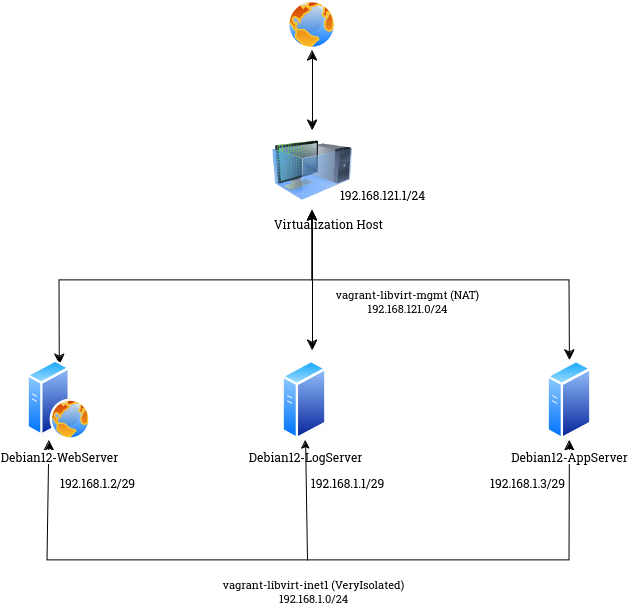

#### Настройка централизованного сбора и хранения журналов и аудита Linux. Rsyslogd, Auditd

> [!NOTE]
> __Rsyslog__ (_The rocket-fast system for log processing_) - _Rsyslog_ — это система с открытым исходным кодом для высокопроизводительной обработки журналов. Это не просто обычный системный регистратор, это универсальный инструмент, 
> который может принимать входные данные из многих источников и выводить их во многие пункты назначения.
> _Rsyslog_ поддерживает пересылку сообщений журнала по IP-сети, в базы данных, электронную почту и т. д. и расширяет базовый протокол syslog мощными возможностями фильтрации.  Он предоставляет мощные параметры конфигурации для адаптации к конкретным потребностям.
[Источник](https://wiki.gentoo.org/wiki/Rsyslog)

> [!NOTE]
> Auditd - собирает информацию о событиях, связанных с безопасностью. Записи аудита можно изучить, чтобы определить, было ли совершено какое-либо нарушение политик безопасности и кем. 

В данной работе используется стенд из трёх виртуальных машин - __Debian12-LogServer__, __Debian12-WebServer__ и __Debian12-AppServer__. На первой машине установлены пакеты _Rsyslog_ и _Audit_, ожидающие подключения от веб-сервера и сервера приложений. 
На виртуальной машине Debian12-WebServer, журналы демона _nginx_ а так-же такие события, как изменение конфигурациронного файла _\/etc\/nginx\/nginx.cfg_ отправляются на сервер централизованного хранения журналов. Здесь службы _Rsyslog_ и _Audit_ настроены на отправку 
сообщений. На виртуальной машине _Debian12-AppServer_ все события отправляются на центральный сервер хранения.


#### Настройка сервера хранения журналов - __Debian12-LogServer__
Установим необходимые пакеты:
```
apt install -y iptables iptables-persistent rsyslog auditd
```
Разрешим _Rsyslog_ прослушивать порт 514(TCP/UDP). Для этого отредактируем файл _\/etc\/rsyslog.conf_:
```
# provides UDP syslog reception
module(load="imudp")
input(type="imudp" port="514")

# provides TCP syslog reception
module(load="imtcp")
input(type="imtcp" port="514")
```
В этом же файле определим, где будут храниться журналы от удаленных систем:
```
# Remote Logs
$template RemoteLogs,"/var/log/%HOSTNAME%/%PROGRAMNAME%.log"
*.* ?RemoteLogs
& stop
```
В файле _\/etc\/audit\/auditd.conf_ раскоментируем строку `tcp_listen_port = 60`. После чего перезапустим сервисы _rsyslog_ и _auditd_:
```
systemctl restart rsyslog.service
systemctl restart auditd.service
```

Настроим _iptables_ для открытия входящих соединений от демонов _rsyslogd_ и _auditd_. За настройки файервола отвечает следующий блок из [Vagrantfile](Vagrantfile):
```
# Политика по умолчанию для цепочки INPUT - DROP
iptables -P INPUT DROP
# Политика по умолчанию для цепочки OUTPUT - DROP
iptables -P OUTPUT DROP
# Политика по умолчанию для цепочки FORWARD - DROP
iptables -P FORWARD DROP
# Базовый набор правил: разрешаем локалхост, запрещаем доступ к адресу сети обратной петли не от локалхоста, разрешаем входящие пакеты со статусом установленного сонединения.
iptables -A INPUT -i lo -j ACCEPT
iptables -A INPUT ! -i lo -d 127.0.0.0/8 -j REJECT
iptables -A INPUT -m state --state ESTABLISHED,RELATED -j ACCEPT
# Открываем исходящие
iptables -A OUTPUT -j ACCEPT
# Разрешим входящие с хоста управления.
iptables -A INPUT -s 192.168.121.1 -j ACCEPT
# Также, разрешим входящие для WebServer и AppServer
iptables -A INPUT -s 192.168.1.0/29 -m tcp -m multiport -p tcp --dports 60,514 -j ACCEPT
iptables -A INPUT -s 192.168.1.0/29 -m udp -p udp --dport 514 -j ACCEPT
# Откроем ICMP ping
iptables -A INPUT -p icmp -m icmp --icmp-type 8 -j ACCEPT
netfilter-persistent save
```
#### Настройка веб сервера - __Debian12-WebServer__
Установим необходимые пакеты:
```
apt install -y iptables nginx rsyslog auditd audispd-plugins
```
Настроим _nginx_ для удалённого хранения журналов:
```
error_log /var/log/nginx/error.log,severity=crit;
error_log syslog:server=192.168.1.1:514,tag=nginx_error;
access_log /var/log/nginx/access.log;
access_log syslog:server=192.168.1.1:514,tag=nginx_access,severity=info combined;
```
В данном случае, журналы ошибок с уровнем критичности _crit_, хранятся локально, независимо от уровня - отпраляются на сервер хранения. 
Журналы доступа независимо от уровня важности храняться локально, с уровнем _info_ - отправляются на удалённый сервер.

Настроим плагин, отвечающий за отправку журнала аудита, входящий в пакет _audispd-plugins_. Для этого активируем его, отредактировав файл _\/etc\/audit\/plugins.d\/au-remote.conf_:
```
active = yes
```
А так же, в файле _/etc/audit/audisp-remote.conf_ укажем адрес сервера - сборщика журналов:
```
remote_server = 192.168.1.1
```
Для добавления правила аудита изменений файла конфигурации _nginx_ создадим файл _\/etc\/audit\/rules.d\/10-audit.rules_  с содержимым:
```
-w /etc/nginx/nginx.conf -p wa
```
И активируем новые правила:
```
augenrules --load
```
Так же, на удалённый сервер сбора журналов будем отпрравлять все события, связанные с безопасностью:
```
echo '' >> /etc/rsyslog.conf
echo 'security.* @@192.168.1.1:514' >> /etc/rsyslog.conf
```
Перезапустим службы:
```
systemctl restart rsyslog.service
systemctl restart auditd.service
```
#### Настройка сервера приложений - __Debian12-AppServer__
Установим необходимые пакеты:
```
apt install -y iptables rsyslog
```
Настроим отправку всех событий на удалённый сервер, для этого добавим в конец файла _\/etc\/rsyslog.conf_ строку:
```
*.* @@192.168.1.1:514
```
И перезапустим _Rsyslog_:
```
systemctl restart rsyslog.service
```
> [!NOTE]
> К данной работе прилагаю также запись консоли. Для того, чтобы воспроизвести выполненные действия,
> необходимо скачать файлы [screenrecord-2024-11-19.script](screenrecord-2024-11-19.script) и [screenrecord-2024-11-19.time](screenrecord-2024-11-19.time),
> после чего выполнить в каталоге с загруженными файлами команду:

```
scriptreplay ./screenrecord-2024-11-19.time ./screenrecord-2024-11-19.script
```
Спасибо за прочтение! :potted_plant:
